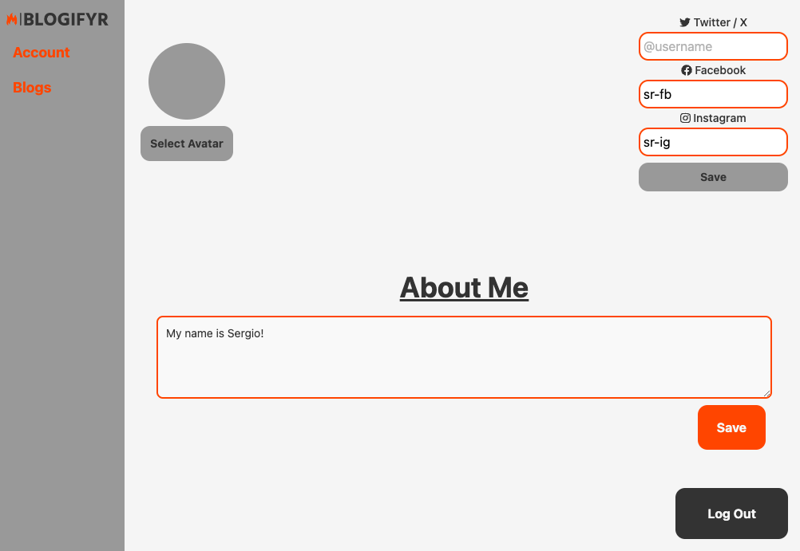
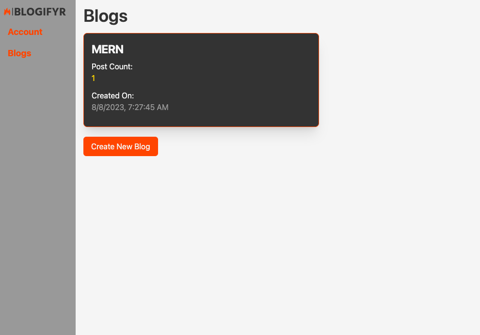
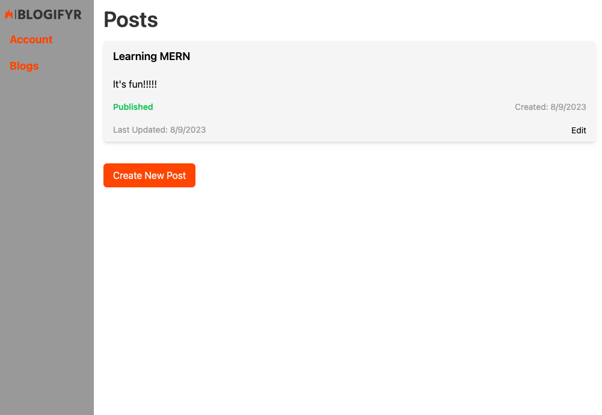
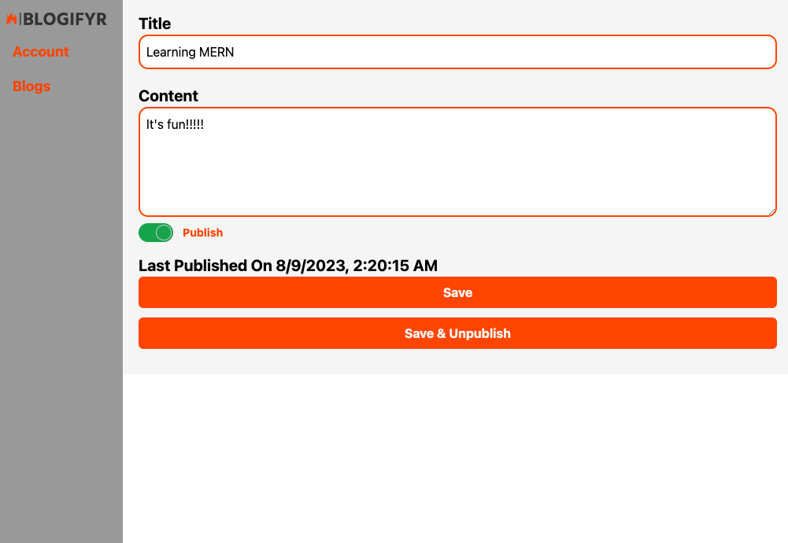
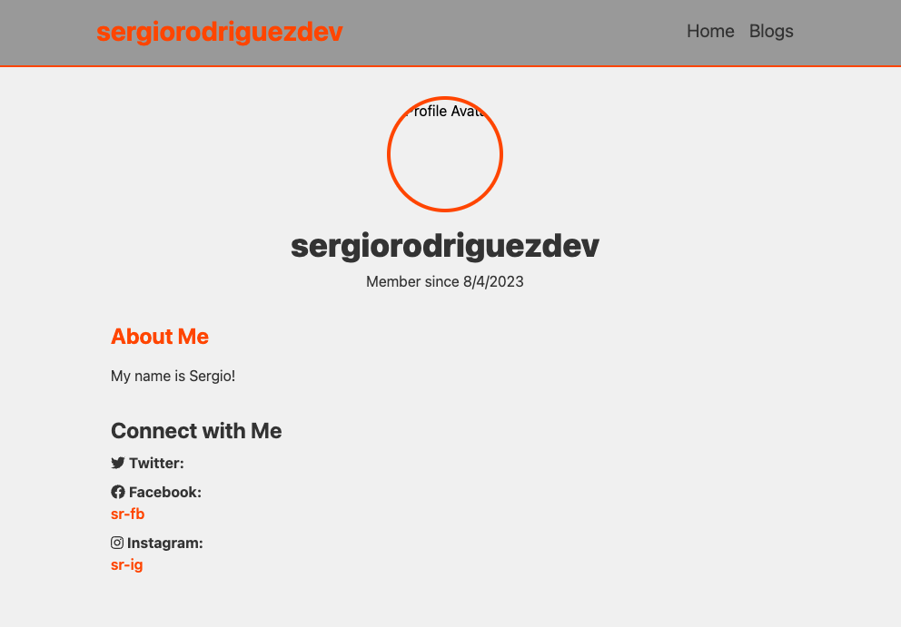
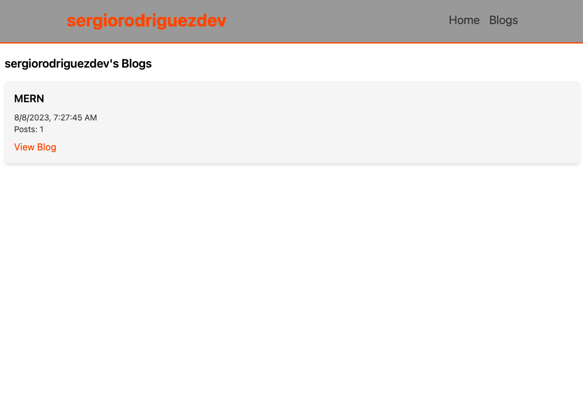
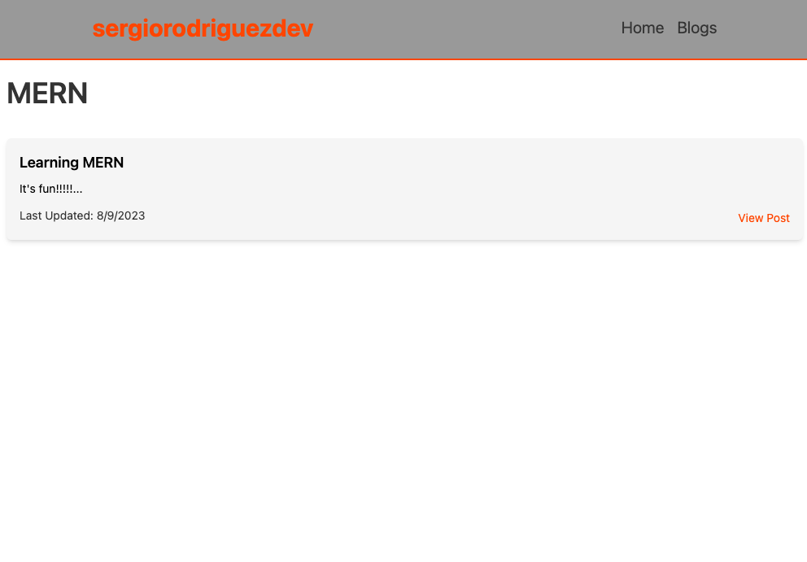
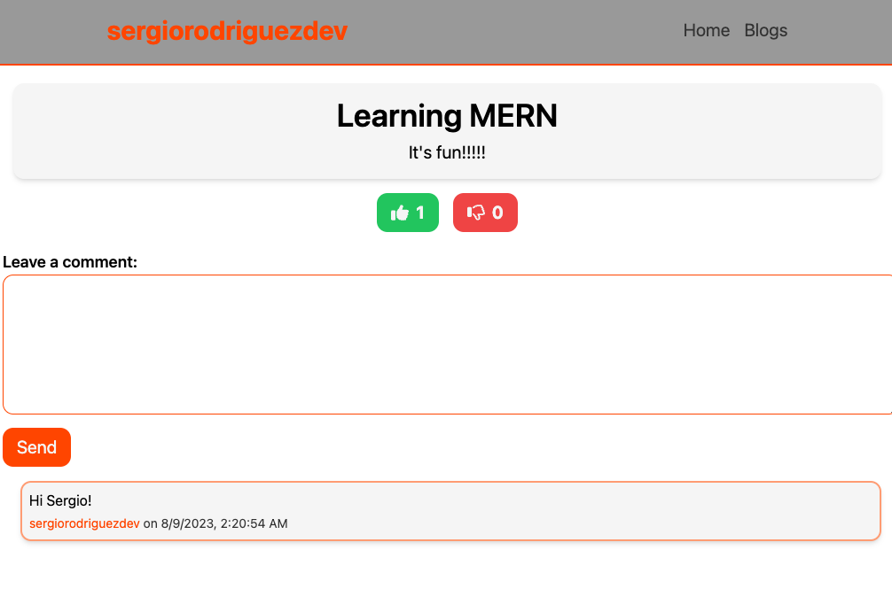

# Blogging Platform

# _Blogifyr_

## Description

Are you a passionate writer, eager to share your ideas with the world? Look no further!
Blogifyr is here to fuel your creativity and empower you to create your very own blog in a flash.
With our blazing fast blog creation process, you can focus on what truly matters – your words.
Unleash your thoughts, tell your stories, and engage with your audience like never before.
Join the Blogifyr community today and let your voice roar!

## Technologies Used

- MERN Stack
- TailwindsCSS
- Apollo GraphQL
- JWT Authentication
- Heroku
- GitHub Actions

## Table of Contents

- [Collaborators](#collaborators)
- [User Story](#user-story)
- [Acceptance Criteria](#acceptance-criteria)
- [Links](#links)
- [How to](#how-to)
- [Future Development](#future-development)
- [Screenshots](#screenshots)

## Collaborators

| Developer | Role                | GitHub Profile                        |
| --------- | ------------------- | ------------------------------------- |
| Kyle      | Front End, Design   | https://github.com/EpipKL             |
| Sergio    | Back End, React JSX | https://github.com/sergiorodriguezdev |

## User Story

```md
AS a user who is passionate about blogging
I WANT an app built on the latest web development technologies
SO THAT I can share my thoughts and ideas with my followers
```

## Acceptance Criteria

```md
GIVEN a blogging site built on the MERN Stack
WHEN I reach the homepage
THEN I am presented with some general information about the site and links to login/sign up
WHEN I click the login/sign up link
THEN I am presented with a login form and a toggle to switch to the sign up form
WHEN I am not logged in and attempt to load my admin dashboard
THEN I am redirected to the login/sign up page
WHEN I successfully log in or sign up
THEN I am redirected to my admin dashboard where I can manage my profile and blog's settings
WHEN I access my blog's settings in the admin dashboard
THEN I can review my existing posts, edit their content, and publish/unpublish them
WHEN I browse to my personal homepage
THEN I am presented with an About Me section, a link to my blog, and social media profile links
WHEN I access my blog
THEN I see a list of published posts sorted in descending order by date
WHEN I access someone else's blog
THEN I see a list of published posts that I can interact with - leave reactions and/or comments
WHEN I am not logged in and access a blog
THEN I see a list of published posts and I am presented with a login/sign up link before I can interact with the posts
```

## Links

Deployed app:

- https://blogifyr-1f22c21543c5.herokuapp.com/

GitHub repo:

- https://github.com/EpipKL/blogifyr

## How to

### User Profile

1. Once logged in, you will be redirected to your User Dashboard.
2. From here, you can update your `About Me` section.
3. Click the `Save` button to save your changes.
4. Additionally, you can enter your social media handles. Click the corresponding `Save` button to save your changes.

To view a user's profile, browse to `/{username}`.

### Blogs & Posts

To manage your blogs:

1. Log in and go to your User Dashboard.
2. Click the `Blogs` link on the navigation side panel.
3. From here you can create a new blog, or select an existing blog to create a post or edit its existing posts.
4. To edit a post, click the `Edit Post` link.
5. You can edit the post's title and content and click `Save` to save your changes.
6. If you are ready to publish your post for others to interact with it, click `Save & Publish`.
7. If you would like to unpublish your post, click the `Save & Unpublish` button.

To view another user's blogs:

1. Go to the user's profile and click the `Blogs` link in the navigation bar.
2. Select a blog to view a list of its posts.
3. Click the `View Post` link to see the post's page and read its content.
4. If you are not logged in, you won't be able to interact with the post until you do so.

### Comments & Reactions

1. Go to the post's page as indicated in the section above to interact with the post.
2. Click the 👍 or 👎 buttons to react to the post. To remove the reaction, simply click the button again.
3. Enter a comment in the space provided and click the `Send` button. Your comment will be added to the top of the list of comments.

## Future Development

- Allow user to add a custom avatar.
- Allow user to select a custom image for their blogs.
- Allow user to change their blog theme.
- Post formatting using Markdown.
- Add additional information to user profile.
- User, blog, and post search functionality.

## Screenshots

















